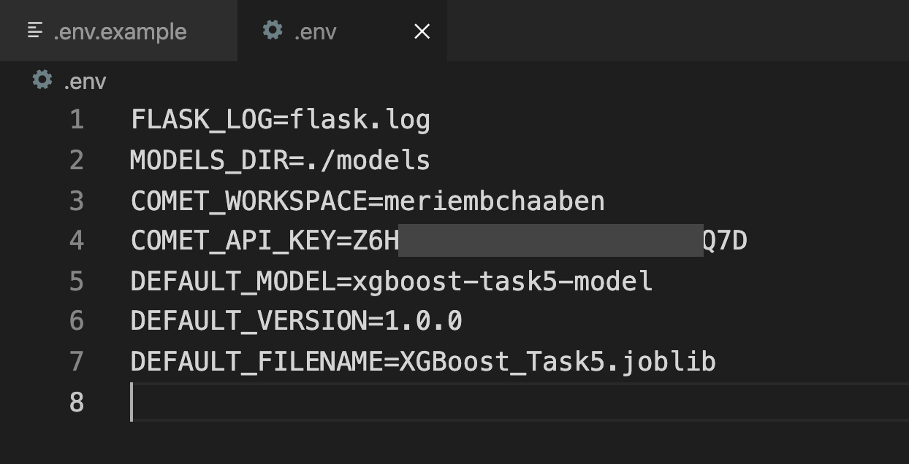
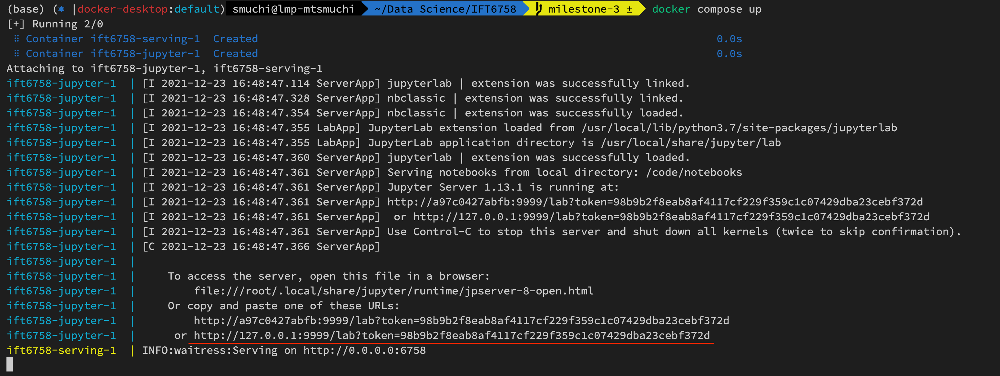
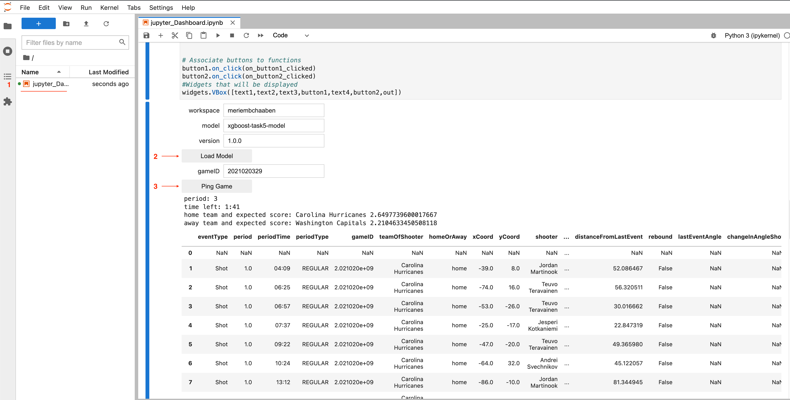

# IFT6758 Milestone 3

In this milestone we're using Docker to deploy our Machine Learning models from previous Milestones.

## Run Entire Project
### Setup
1. Install Docker
2. Create a `.env` file using the template shown in the `.env.example` file.
3. In `.env` add a valid API key for the `COMET_API_KEY` environment variable, i.e. replace the `____REPLACE_ME____` value with an API key value obtained from the [comet.ml model repository](https://www.comet.ml/meriembchaaben/ift6758).

Your `.env` file should look like this:
  

### Start Server Side and Jupyter Notebook containers
To run the project: `docker compose up`.

The first time this command is run it will also build the Docker images.

### Test the Jupyter Notebook Dashboard
1. Once `docker compose up` has started the two containers, search in your terminal window for a URL like this one `http://127.0.0.1:9999/lab?token=a_unique_token_here`.
   
2. Open this URL in a web browser. A Jupyter Lab instance should open.
3. Open and Run the notebook called `jupyter_Dashboard.ipynb`
inside the Jupyter Labs instance.
    
## Rebuild Container Images
If required to re-build the images: `docker compose build`.

## Convenience Testing Scripts - Server-Only
To run the server-only:  `./build.sh && ./run.sh`.

## Project Details
**Containers**
- Front end: `jupyter`
  - Role: runs Jupyter Lab to display model predictions, queries the back-end
- Back end: `serving`
  - Role: serves model predictions

**Ports** _(`container:host`)_
- Frontend port: `9999:9999`
- Backend port: `6758:6758`

**Files**
- The assets located in the `models` and `notebooks` directories are two-way synced between the host and Docker container, using Docker `volumes`. Thus:
  - Any changes made locally will be reflected inside the Docker container.
  - Any changes made inside the Docker container will be presisted locally.
